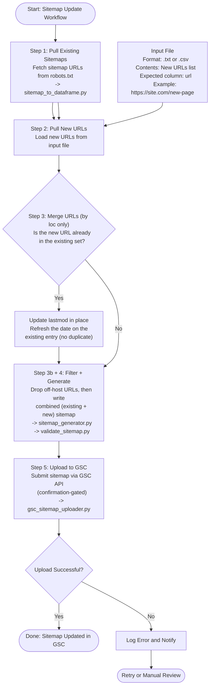

# Sitemap Update Automation

A small, domain-agnostic toolkit to keep XML sitemaps current. It pulls a site's
existing sitemap URLs, merges in a list of new URLs (deduping by URL only and
refreshing `<lastmod>` dates in place), regenerates **fresh Google-compliant
sitemaps**, validates them, and (optionally, behind a confirmation prompt)
submits them to Google Search Console.

Works on any domain. Nothing is hardcoded to one site.

> ### Want this fully hands-off?
> This repo is the do-it-yourself version. If you'd rather **never touch a
> sitemap again**, I build end-to-end pipelines that auto-discover your URLs,
> merge and deduplicate new pages, validate against Google's rules, and submit
> to Search Console on a schedule, with zero manual steps and monitoring for
> failures.
>
> **Kiran Babu Thatha** — technical SEO + automation.
> Reach me at **https://www.kiranbabuthatha.com** to automate your sitemap
> generation completely.

## Workflow

```
Start
  1. Pull existing sitemaps from robots.txt        -> sitemap_to_dataframe.py
  2. Load new URLs from an input file (.csv/.txt)
  3. Merge by URL only: update <lastmod> in place for URLs that already
     exist, append genuinely new ones (optional trailing-slash normalization)
  3b. Drop off-host URLs (Google requires one host per sitemap)
  4. Generate combined (existing + new) sitemaps   -> sitemap_generator.py
     (home/root URL always lands in the pages sitemap; or one flat file)
     then validate the output                      -> validate_sitemap.py
  5. Upload to GSC (separate, confirmation-gated)   -> gsc_sitemap_uploader.py
Done  |  on failure: log + notify -> retry / manual review
```



The diagram source is in [`docs/workflow.mmd`](docs/workflow.mmd).

Each run is a **full regeneration**: you always get one clean, current set of
sitemaps (live URLs + new URLs), never a pile of per-batch files.

## Install

```bash
pip install -r requirements.txt
```

`pandas` and `requests` cover steps 1 to 4. The `google-*` libraries are only
needed for the GSC submit step.

## Quick start

Verify everything works offline first (no network, no GSC):

```bash
python test_sitemap.py        # expect: ALL PASSED
```

Generate combined sitemaps for a site:

```bash
python sitemap_workflow.py update \
    --site https://www.example.com \
    --input examples/sample_urls.csv \
    --base-url https://www.example.com \
    --group-by path_depth --depth 1 \
    --with-lastmod \
    --out ./sitemaps
```

Start completely fresh (wipe old output, then regenerate):

```bash
python sitemap_workflow.py clean --out ./sitemaps --yes
python sitemap_workflow.py update \
    --site https://www.example.com \
    --input examples/sample_urls.csv \
    --base-url https://www.example.com \
    --trailing-slash add \
    --refresh-lastmod --with-lastmod \
    --out ./sitemaps
```

Or generate a single flat `sitemap.xml` instead of grouped child sitemaps:

```bash
python sitemap_workflow.py update \
    --site https://www.example.com \
    --input examples/sample_urls.csv \
    --base-url https://www.example.com \
    --single-file --with-lastmod \
    --out ./sitemaps
```

Validate the result:

```bash
python sitemap_workflow.py validate ./sitemaps/sitemap_index.xml
# (for --single-file there is no index; validate the file directly)
python sitemap_workflow.py validate ./sitemaps/sitemap.xml
```

Submit to Google Search Console (asks for confirmation; writes to your live
property):

```bash
python sitemap_workflow.py submit \
    --site https://www.example.com/ \
    --base-url https://www.example.com \
    --out ./sitemaps \
    --credentials client_secrets.json --auth-mode oauth
```

## Commands

### `update` — steps 1 to 4

| Flag | Default | Meaning |
|------|---------|---------|
| `--site` | (none) | Site to pull existing sitemaps from. Omit for a brand-new site. |
| `--input` | required | New URLs file: `.csv` with a `url` column (optional `lastmod`), or `.txt` one URL per line. |
| `--base-url` | from `--site` | Absolute base used for sitemap-index `<loc>` URLs and for the same-host filter. |
| `--group-by` | `path_depth` | Grouping strategy (see below). |
| `--depth` | `1` | Path depth for `path_depth` grouping. |
| `--min-urls-per-group` | `2` | Groups smaller than this merge into `other`. |
| `--prefix` | `sitemap` | Output filename prefix. |
| `--out` | `./sitemaps` | Output directory. |
| `--trailing-slash` | `keep` | Normalize trailing slashes for dedupe **and** output: `add` forces a slash (`/blog` -> `/blog/`), `strip` removes it, `keep` leaves URLs untouched. Root, query/fragment, and file-like URLs (e.g. `.xml`) are never changed. |
| `--single-file` | off | Write ONE flat `sitemap.xml` with all URLs — no child sitemaps, no index. Overrides `--group-by`. (Auto-splits + adds an index only past 50,000 URLs.) |
| `--refresh-lastmod` | off | For input URLs that **already** have a `<lastmod>`, refresh it to today's generation date. An explicit lastmod in the input still wins; input URLs with no prior date stay dateless. Emit it with `--with-lastmod`. |
| `--with-lastmod` | off | Emit `<lastmod>` when present in the data. |
| `--legacy-tags` | off | Also emit `<changefreq>`/`<priority>` (Google ignores these). |

### `validate` — check any sitemap

```bash
python sitemap_workflow.py validate <path-or-url> [--recurse]
```

Enforces Google's rules: well-formed XML, absolute same-host `<loc>`, max 50,000
URLs and 50 MB per file, max 2,048-char URLs, valid W3C `lastmod`, no duplicates.
`--recurse` walks an index and validates each child sitemap over HTTP.

### `submit` — step 5, GSC upload

Confirmation-gated by default; pass `--yes` to skip the prompt in automation.
Never runs as part of `update`.

### `clean` — wipe generated artifacts for a fresh run

```bash
python sitemap_workflow.py clean --out ./sitemaps         # asks to confirm
python sitemap_workflow.py clean --out ./sitemaps --yes   # no prompt
```

Deletes the output directory, the run log (`SITEMAP_LOG.md`), and `__pycache__`.
It only removes **generated** files — your source, input CSVs, and credentials
are never touched. Confirmation-gated by default; pass `--yes` in automation.

## Merge & dedupe behavior

- **Dedupe is by `<loc>` only.** Two entries are "the same URL" purely by their
  location; `<lastmod>` is never part of the identity check.
- **Existing URL + new entry -> updated in place.** If an incoming URL already
  exists, its `<lastmod>` is refreshed to the new value instead of creating a
  second entry.
- **New URL -> appended.** Genuinely new URLs are added to the combined set.
- **Refresh dates on demand.** With `--refresh-lastmod`, any input URL that
  already had a `<lastmod>` gets re-stamped to today's generation date (an
  explicit input date still wins; input URLs with no prior date stay dateless).
- **Trailing slashes** are treated as significant by default (`/blog` and
  `/blog/` are different URLs). Use `--trailing-slash add|strip` to make dedupe
  slash-insensitive and emit one canonical form.

## Home / root URL placement

The site root (`https://site.com/` or `https://site.com`) is always routed to
the **pages** sitemap (`sitemap_pages.xml`), regardless of grouping strategy,
and is protected from the small-group merge — so your home page never gets
buried in `blog`, `seo`, or `other`.

## Grouping strategies (`--group-by`)

| Strategy | One sitemap per... |
|----------|--------------------|
| `path_depth` (default) | first N path segments (`--depth N`); small groups merged into `other` |
| `first_segment` | top-level path segment (`/en/...` -> `en`) |
| `single` | the whole site (auto-splits past 50,000 URLs) |
| `lastmod_month` | `YYYY-MM` of `<lastmod>` (undated -> `undated`) |

Add your own by dropping a function into `GROUPERS` in `sitemap_workflow.py`
with signature `group_func(url: str, entry: dict) -> str`, or by calling
`generate_sitemaps(..., group_func=...)` directly.

> `--group-by single` still writes one urlset (`sitemap_all.xml`) **plus** a
> sitemap index. If you want a single bare `sitemap.xml` with **no** index, use
> the `--single-file` flag instead.

## Input file format

CSV with a required `url` column and optional `lastmod`:

```csv
url,lastmod
https://www.example.com/new-page,2026-05-27
https://www.example.com/another-page,2026-05-27
```

Or a plain `.txt`, one URL per line (`#` lines ignored).

## Common gotchas

- **`www` vs non-`www`.** `--base-url` host must exactly match the host in your
  URLs. Google treats `https://example.com` and `https://www.example.com` as
  different hosts, so a mismatch makes the same-host filter drop everything.
- **Empty output.** If `update` writes nothing, the existing + new set was empty
  after filtering (often the `www` mismatch above, or off-host input URLs).
- **Only new URLs in output.** You omitted `--site`, so there was no existing set
  to merge. Add `--site` to pull and combine live URLs.
- **Jupyter `argparse` error mentioning `ipykernel_launcher.py`.** You called
  `main()` without passing the argument list. Use `wf.main([...])`, or shell out
  with `!python sitemap_workflow.py update ...`.
- **Windows `UnicodeEncodeError` on the `🚀`/`✔` output.** The default console
  codec (cp1252) can't print the status emoji. Force UTF-8 for the run:
  `set PYTHONUTF8=1` (cmd) or `$env:PYTHONUTF8=1` (PowerShell), then run as usual.
- **A page appears twice (with and without a trailing slash).** `/page` and
  `/page/` are distinct URLs by default. Run with `--trailing-slash add` (or
  `strip`) to collapse them into one canonical entry.

## Files

```
sitemap_workflow.py        Orchestrator / CLI (entry point)
sitemap_to_dataframe.py    Step 1: robots.txt -> existing sitemap URLs
sitemap_generator.py       Step 4: group + write Google-compliant XML
validate_sitemap.py        Validator (Google rules)
gsc_sitemap_uploader.py    Step 5: submit to Search Console
test_sitemap.py            Offline test suite (no network)
examples/sample_urls.csv   Sample input
docs/workflow.mmd          Mermaid workflow diagram
requirements.txt           Dependencies
```

## Safety notes

- Steps 1 to 4 are read-only or write only local files.
- **Step 5 submits to your live GSC property** and is confirmation-gated.
  `client_secrets.json`, `service_account.json`, and `gsc_token.json` are
  git-ignored. Never commit credentials.
- Every run appends a summary to `SITEMAP_LOG.md` (git-ignored).

## Further reading

For a detailed walkthrough of how this toolkit works and the design decisions behind it, see the companion blog post:
**[Automating XML Sitemap Generation with Python](https://kiranbabuthatha.com/blog/automating-xml-sitemap-generation-with-python/)**

## Hire me / full automation

This toolkit covers the manual workflow. If you want your sitemaps maintained
**completely automatically**, with no scripts to run and no CSVs to manage, I
set up the full pipeline for you: scheduled URL discovery, dedup and validation,
Search Console submission, and alerting when something breaks.

Get in touch to have your sitemap generation automated end to end:
**https://www.kiranbabuthatha.com**

— Kiran Babu Thatha, technical SEO + automation.

## License

MIT — see [LICENSE](LICENSE). Copyright (c) 2026 Kiran Babu Thatha.
